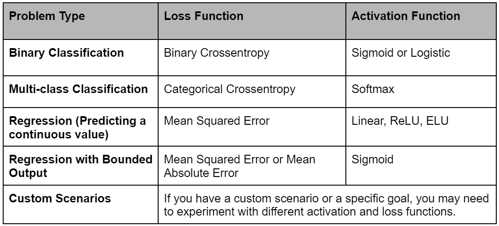
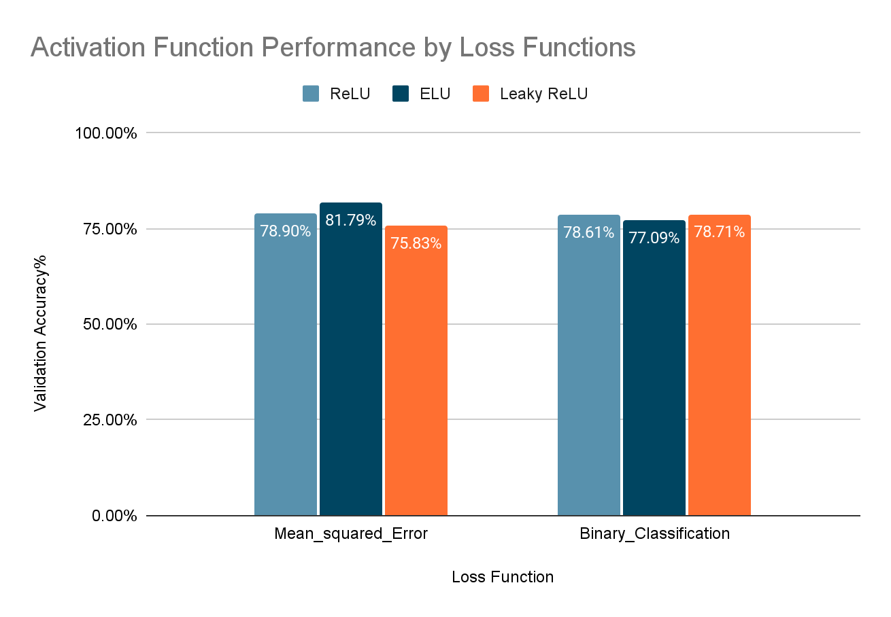
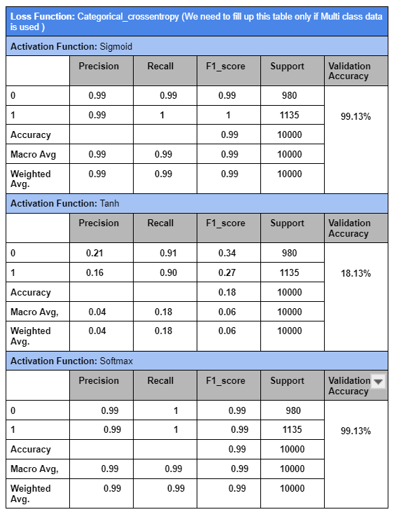

# A Practical Approach: Running Test cycle with different choices of Loss function and Activation Functions.

We will use Heart failure clinical record data set (source:https://www.kaggle.com/datasets/andrewmvd/heart-failure-clinical-data/data). We will use ANN model with several activation functions with the same loss function.

We are trying to predict / classify …..  

Cardiovascular diseases (CVDs) are the number 1 cause of death globally, taking an estimated 17.9 million lives each year, which accounts for 31% of all deaths worlwide.

Heart failure is a common event caused by CVDs and this dataset contains 12 features that can be used to predict mortality by heart failure.

Most cardiovascular diseases can be prevented by addressing behavioural risk factors such as tobacco use, unhealthy diet and obesity, physical inactivity and harmful use of alcohol using population-wide strategies.

People with cardiovascular disease or who are at high cardiovascular risk need early detection and management wherein a ML or DL model can be of great help.

We will predict the survival of patients with heart failure from serum creatinine and ejection fraction alone. For that our aim is:

- To classify / predict whether a patient is prone to heart failure depending on multiple attributes.
- It is a binary classification with multiple numerical and categorical features.

## About the data:
- age: Age of the patient
- anemia: If the patient had the hemoglobin below the normal range
- creatinine_phosphokinase: The level of the creatine phosphokinase in the blood in mcg/L
- diabetes: If the patient was diabetic
- ejection_fraction: Ejection fraction is a measurement of how much blood the left ventricle - - pumps out with each contraction
- high_blood_pressure: If the patient had hypertension
- platelets: Platelet count of blood in kilo platelets/mL
- serum_creatinine: The level of serum creatinine in the blood in mg/dL
- serum_sodium: The level of serum sodium in the blood in mEq/L
- sex: The sex of the patient
- smoking: If the patient smokes actively or ever did in past
- time: It is the time of the patient's follow-up visit for the disease in months
- DEATH_EVENT: If the patient deceased during the follow-up period

## Summary of Validation Accuracy(Closing Call)
 
 
 
 
  

## Classification:
